.. _attribute_management:

==================================
Attribute Management in Authentic2
==================================

Summary
=======

Attribute management currently allows to configure attribute policies
associated with SAML2 service providers to define attributes that are
pushed in SAML2 successful authentication response delivered by Authentic2.

User attributes can be taken from LDAP directories, the user Django
profile or taken from the user Django session if Authentic2 is also configured
as a SAML2 service provider.

Indeed, when Authentic2 acts also as a SAML2 service provider,
attributes contained in the SAML2 assertion received from third IdP are put in
the user session.

Attributes can thus be proxyfied during SSO with Authentic2
configured as a SAML2 proxy.

The namespace of attributes received from another SAML2 IdP and of attributes
pushed in the assertion given to service providers can be configured per
attribute or per service provider.

By default, the namespace and format of attributes in assertion is conformant
to the SAMLV2.0 X500/LDAP Attribute profile::

    <saml:Attribute
        xmlns:x500="urn:oasis:names:tc:SAML:2.0:profiles:attribute:X500"
        NameFormat="urn:oasis:names:tc:SAML:2.0:attrname-format:uri"
        Name="urn:oid:2.5.4.42" FriendlyName="givenName">
        <saml:AttributeValue xsi:type="xs:string"
            x500:Encoding="LDAP">Mikaël</saml:AttributeValue>
    </saml:Attribute>

But the http://schemas.xmlsoap.org/ws/2005/05/identity/claims from the ISI
profile can also be used, for instance::

    <saml:Attribute
        NameFormat="urn:oasis:names:tc:SAML:2.0:attrname-format:uri"
        Name="http://schemas.xmlsoap.org/ws/2005/05/identity/claims/givenname"
        FriendlyName="First Name">
        <saml:AttributeValue>Mikaël</saml:AttributeValue>
    </saml:Attribute>

Configuration
=============

Configure local sources of attributes
-------------------------------------

The source of attributes for authentic2 are of two kinds. The LDAP sources and
the user django profile.

Declare the Django profile source
_________________________________

Add an attribute source named USER_PROFILE with namespace 'Default'.

1. Go to http[s]://your.domain.com/admin/attribute_aggregator/attributesource/add/

2. Write 'USER_PROFILE' in name field

.. image:: pictures/user_profile_source.png
   :width: 800 px

3. Save

.. image:: pictures/user_profile_source_saved.png
   :width: 800 px

Add an LDAP Source
__________________

For LDAP sources, objects of type 'LDAPSource' must be created.

**Even if the authentication is based on LDAP authentification, thus that a
server is configured in settings.py, it is
necessary to create a corresponding 'LDAPSource' to use it as a source of
attribute.**

1. Go to http[s]://your.domain.com/admin/attribute_aggregator/ldapsource/add/

2. Fill form fields

Only the field Name, Server, User, Password, Base and Port are used for now.
**The namespace of LDAP source must be kept to 'Default', since the system
namespace is based on LDAP.**

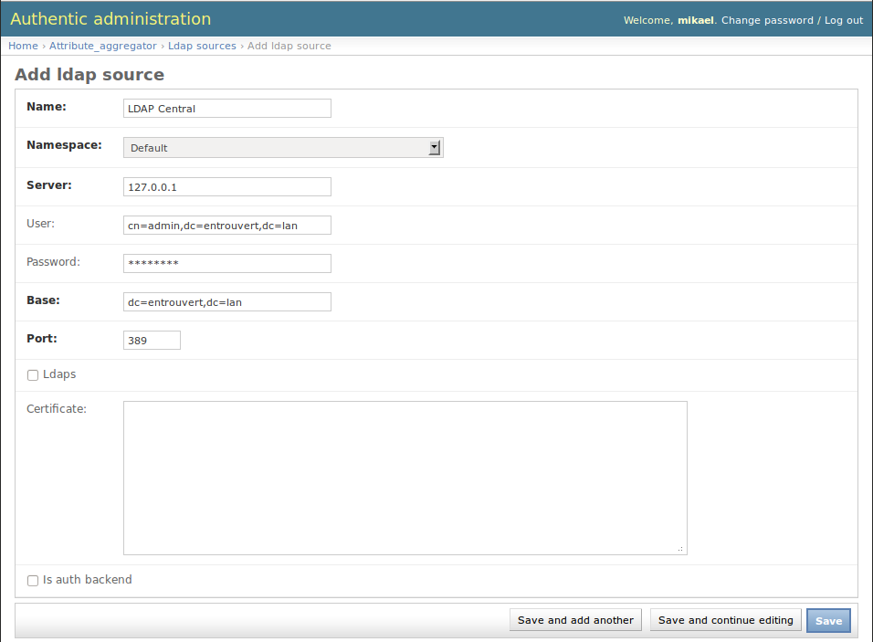

3. Save

.. image:: pictures/ldapsource_saved.png
   :width: 800 px

Manage user distinguished names in LDAP directories
___________________________________________________

To find the user in a LDAP directory, authentic2 must know its distinguished
name (DN). If this LDAP has been used when the user has authenticated,
Authentic2 learn the user DN. Nothing has to be done from this point of view.

However, if it is expected that user attributes be taken in a directory that
is not used by the user for authentication, it is necessary to manually
indicate to Authentic2 what is the user DN in the directory. For this, a
user alias in source is created for the user:

1. Go to http[s]://your.domain.com/admin/attribute_aggregator/useraliasinsource/add/

2. Fill form fields

.. image:: pictures/alias_in_source.png
   :width: 800 px

3. Save

.. image:: pictures/alias_in_source_saved.png
   :width: 800 px

Configure attributes from local sources pushed to SAML2 service providers in SSO response
-----------------------------------------------------------------------------------------

Reminder:

- The default name format in SAML2 assertions is URI
- The default namespace called 'Default' is LDAP

In summary:

1. Create attribute items indicating an attribute name, a source, the name format expected and the namespace expected for the attribute name and friendly name if any.

2. Create a named list of attribute items.

3. Create an attribute policy and associate the previous list or associate the previous list to a existing attribute policy.

4. Associate the policy to a service provider.

Create attribute items
______________________

1. Go to http[s]://your.domain.com/admin/idp/attributeitem/add/

2. Fill form fields

.. image:: pictures/attribute_item.png
   :width: 800 px

3. Save

.. image:: pictures/attribute_item_saved.png
   :width: 800 px

Create a named list of attribute items
______________________________________

1. Go to http[s]://your.domain.com/admin/idp/attributelist/add/

2. Name the list and add items to list

.. image:: pictures/attribute_list.png
   :width: 800 px

3. Save

.. image:: pictures/attribute_list_saved.png
   :width: 800 px

Create or modify an attribute policy
____________________________________

1. Go to http[s]://your.domain.com/admin/idp/attributepolicy/add/

2. Add list to the policy

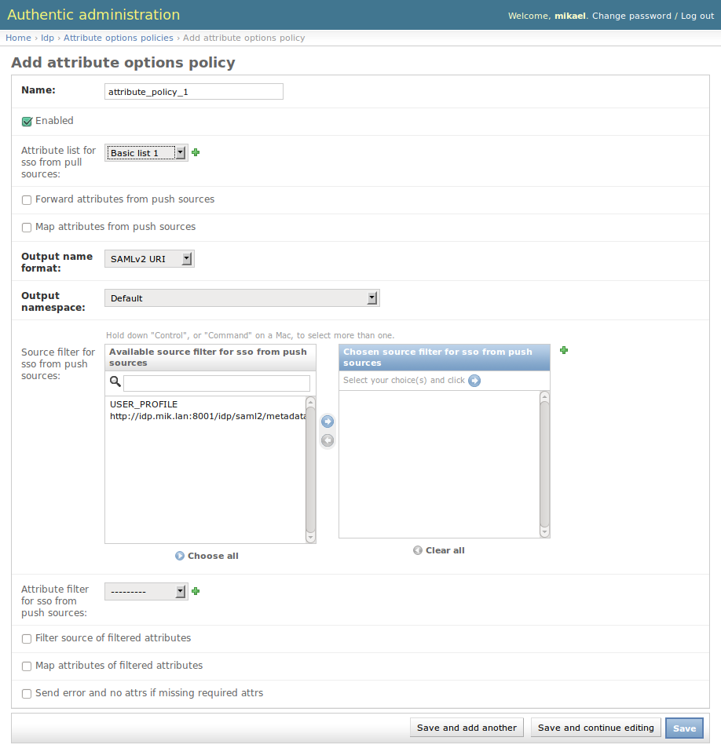

3. Save

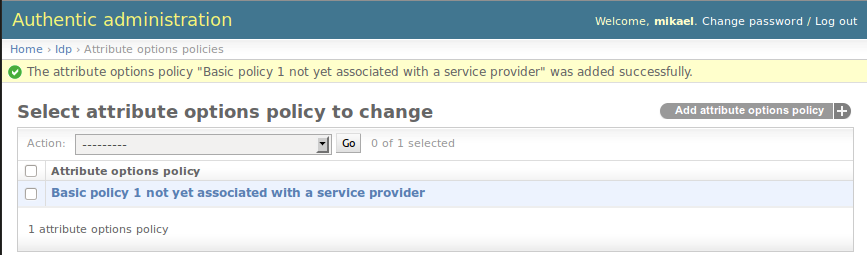

Associate the policy to a service provider
__________________________________________

1. Go to http[s]://your.domain.com/admin/saml/libertyprovider/1/

2. Add policy to the service provider

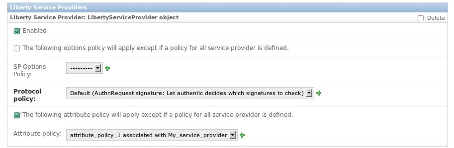

3. Save

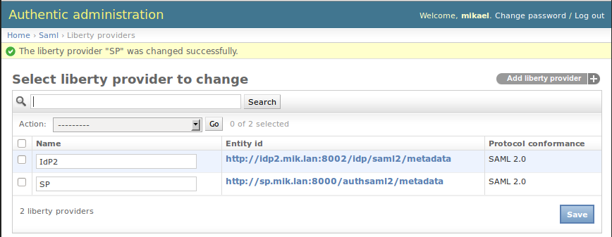

4. The display name of the policy has changed

.. image:: pictures/policy_pull_renamed.png
   :width: 800 px

Handle attributes provided by other Identity providers and pushed to SAML2 service providers in SSO response (proxy attributes)
-------------------------------------------------------------------------------------------------------------------------------

To have these kind of attributes to forward, authentic must be configured as a
SAML2 service provider, see the corresponding administration page
:ref:`config_saml2_idp`.

Forward all attributes in session without any modification
__________________________________________________________

Create or modify an attribute policy activating the option 'Forward attributes from push sources' and save.

**No other option below must be used.**

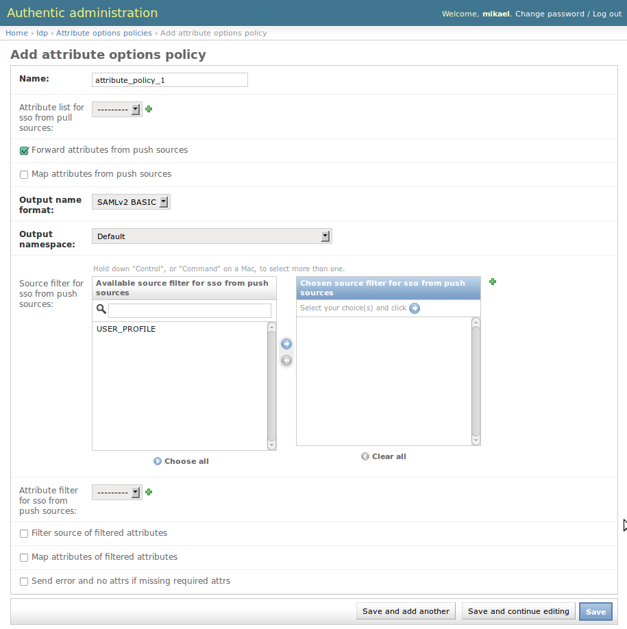

**Attach policy to the service provider if it is not yet the case.**

**No need to deal with namespace here.**

Filter attributes from source only
__________________________________

Here, you want to forward **all** attributes of selected source of attributes.

First of all you need to create objects corresponding to the sources of
attributes.

**The name of the source object must be the entity ID of the SAML2
identity provider.**

1. Go to http[s]://your.domain.com/admin/attribute_aggregator/attributesource/add/

2. Set the name (No need to change the namespace)

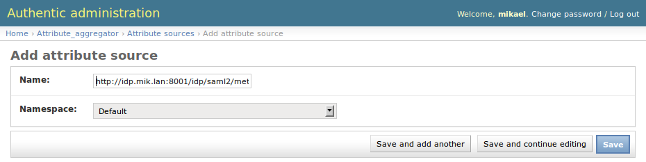

3. Save

.. image:: pictures/attr_source_idp_saved.png
   :width: 800 px

Then create or modify an attribute policy activating the option **'Forward attributes from push sources'**.
You then select the source you want to forward attributes through the selection box and you save.

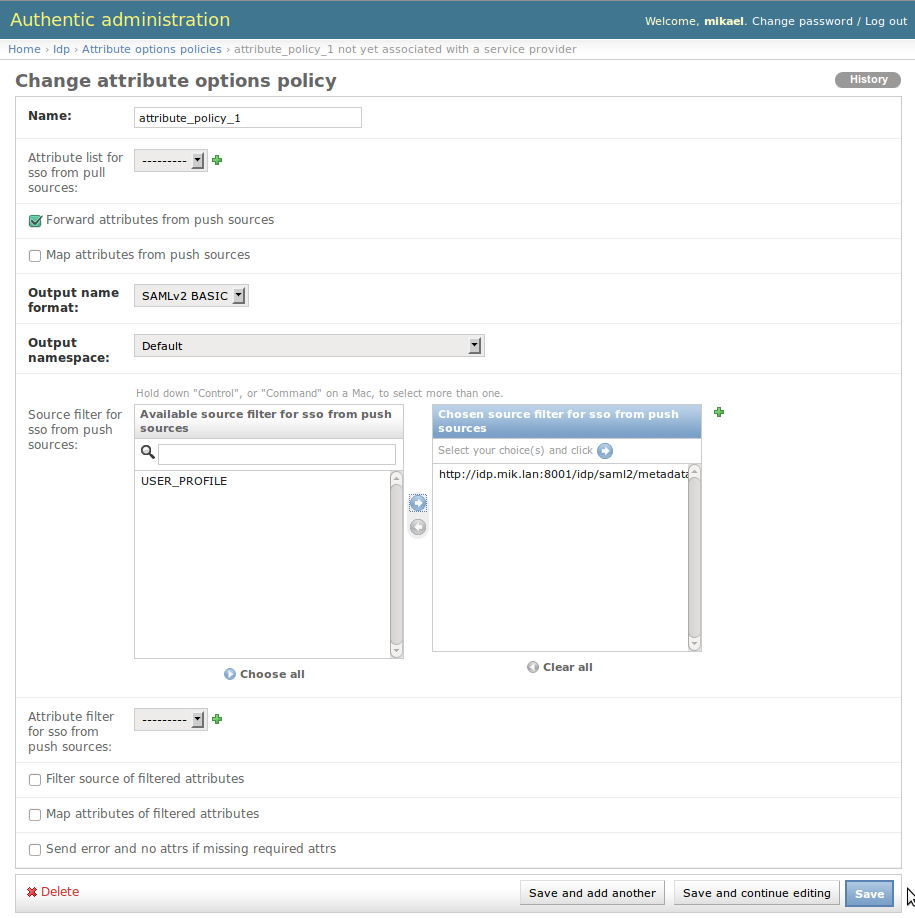

**Attach policy to the service provider if it is not yet the case.**

**No need to deal with namespace here.**

Modify namespace of attributes forwarded when attributes forwarded are not filtered or when filtered according to the source
____________________________________________________________________________________________________________________________

The system needs to 'recognise the attributes' to perform the mapping.
For this, you need to indicate the namespace of attributes received per source
if the namespace is not the one of Authentic2 (X500/LDAP and extensions edu*
and supann).

In other words if the source provides attributes in a different namespace, you
need to create objects corresponding to the sources of attributes and indicate
there the right namespace. By default, the only other supported namespace is
http://schemas.xmlsoap.org/ws/2005/05/identity/claims.

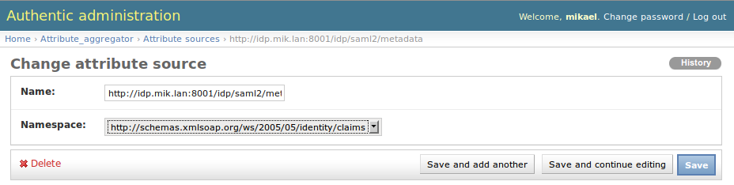

Then create or modify an attribute policy activating the options 'Forward attributes from push sources',
**'Map attributes from push sources'**. You also choose the output namespace expected with the
parameters **'Output name format'** and **'Output namespace'**.

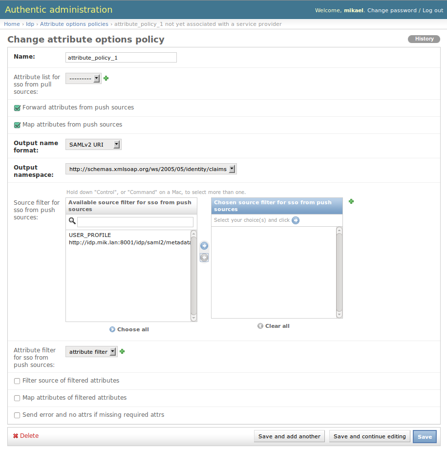

Remind that the default namespace is X500/LDAP + edu* + supann and the only other supported namespace is
http://schemas.xmlsoap.org/ws/2005/05/identity/claims.

**Attach policy to the service provider if it is not yet the case.**

Filter attributes with a list of attributes, with or without choosing the source
________________________________________________________________________________

The system needs to 'recognise the attributes' to filter the attributes
according to a list of attributes.
For this, you need to indicate the namespace of attributes received per source
if the namespace is not the one of Authentic2 (X500/LDAP and extensions edu*
and supann).

In other words if the source provides attributes in a different namespace, you
need to create objects corresponding to the sources of attributes and indicate
there the right namespace. By default, the only other supported namespace is
http://schemas.xmlsoap.org/ws/2005/05/identity/claims.

You then create an attribute list as described in section *'Create a named list of attribute items'*.

Then create or modify an attribute policy activating the option **'Forward attributes from push sources'**.
You then associate the list of attributes.

.. image:: pictures/attr_policy_filter_attributes.png
   :width: 800 px

If you want to also filter according to the source you can configure it as defined in section *'Filter attributes from source only'*. You can also choose to filter
with the source indicate per attribute item of the list. For this select the option **'Filter source of filtered attributes'**.

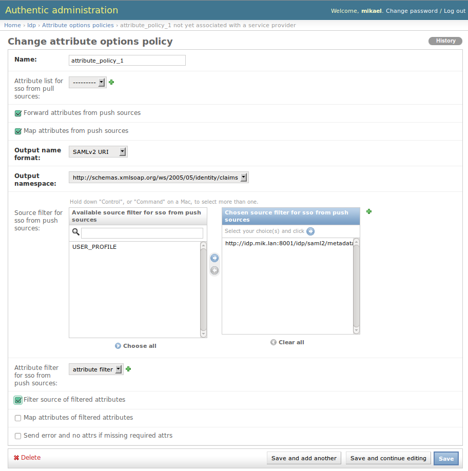

.. image:: pictures/attribute_item.png
   :width: 800 px

The default name format is BASIC. You can however change the name format and namespace with the option **'Map attributes from push sources'** and the parameters **'Output name format'** and **'Output namespace'**.

Using the option **'Map attributes of filtered attributes'** the output name format and namespace are the ones indicated per attribute item of the list.

.. image:: pictures/attribute_item.png
   :width: 800 px

Push manually (writing bits of code) attributes to SAML2 service providers in SSO response
------------------------------------------------------------------------------------------

In idp/signals.py connect to the add_attributes_to_response signal::

    add_attributes_to_response.connect(your_function)

Your function must return an attribute dictionnary as follows::

    dic = {}
    attributes = {}
    attributes[name] = (value1, value2, )
    attributes[(name, format)] = (value1, value2, )
    attributes[(name, format, nickname)] = (value1, value2, )
    dic['attributes'] = attributes
    return dic

*format* must be in (lasso.SAML2_ATTRIBUTE_NAME_FORMAT_URI,
lasso.SAML2_ATTRIBUTE_NAME_FORMAT_BASIC)

You can use the attributes form the local source and the attributes in the
session that are pushed by other identity providers.

Attributes in the session are in::

    request.session['multisource_attributes']

See the page :ref:`attributes_in_session`.

If you want to use local source of attributes and use mapping capabilities
of the UserAttributeProfile see the page :ref:`attribute_management_explained`.
Use the file idp/attributes.py as an exemple.

Modifying supported namespaces and attribute name mappings
==========================================================

The mapping is defined in the file attribute_aggregatore/mapping.py

The manual modification of this file is necessary to extend the default schema
and mappings.

Add new namespaces in ATTRIBUTE_NAMESPACES.

To extend the default schema add key/value in ATTRIBUTE_MAPPING, for instance::

    "displayName": {
        "oid": "2.16.840.1.113730.3.1.241",
        "display_name": _("displayName"),
        "type": "http://www.w3.org/2001/XMLSchema#string",
        "syntax": "1.3.6.1.4.1.1466.115.121.1.15",
    },

Add mapping of attribute name extending attribute entries in ATTRIBUTE_MAPPING,
for instance::

    "sn": {
        "oid": "2.5.4.4",
        "display_name": _("sn surname"),
        "alias": ['surname'],
        "profile_field_name": 'last_name',
        "type": "http://www.w3.org/2001/XMLSchema#string",
        "namespaces": {
            "http://schemas.xmlsoap.org/ws/2005/05/identity/claims": {
                "identifiers":
                    [
                "http://schemas.xmlsoap.org/ws/2005/05/identity/claims/surname",
                    ],
                "friendly_names":
                    [
                "Last Name",
                    ],
            }
        }
    },
