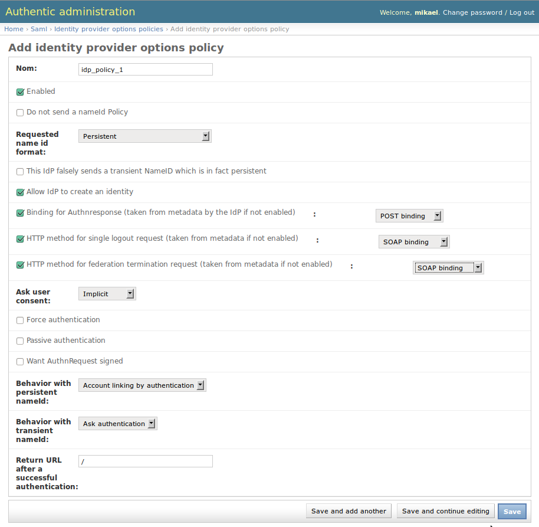
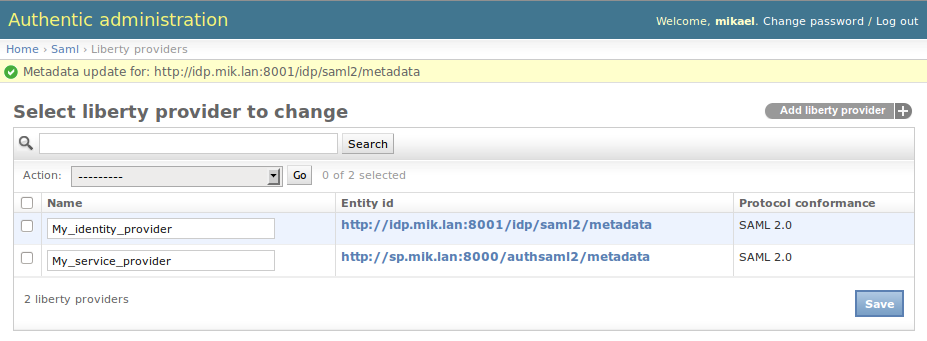

.. _config_saml2_idp:

==================================================================
Configure Authentic 2 as a SAML2 service provider or a SAML2 proxy
==================================================================

**The configuration to make Authentic 2 a SAML2 service provider or a SAML2
proxy is the same. The difference comes from that Authentic 2 is may be
configured or not as a SAML2 identity provider.**

How do I authenticate against a third SAML2 identity provider?
==============================================================

1. Declare Authentic 2 as a SAML2 service provider on your SAML2 identity provider using the SAML2 service provider metadata of Authentic 2.

Go to http[s]://your.domain.com/authsaml2/metadata

2. Add and configure a SAML2 identity provider entry in Authentic 2 using the metadata of the identity provider.

How do I add and configure a SAML2 identity provider in Authentic 2?
====================================================================

You first need to create a SAML2 identity provider entry with the SAML2
metadata of the identity provider. Then, you configure it.

If your identity provider is Authentic 2, the metadata are available at:

    http[s]://your.domain.com/idp/saml2/metadata

See :ref:`where_metadata` for more information.

Create a SAML2 identity provider entry
--------------------------------------

You first need to create a new SAML2 identity provider entry. This requires
the SAML2 metadata of the identity provider.

1. Go to

    http[s]://your.domain.com/admin/saml/libertyprovider/add/

2. Fill the form fields

.. image:: pictures/new_saml2_idp_1.png
   :width: 800 px
   :align: center

.. image:: pictures/new_saml2_idp_2.png
   :width: 800 px
   :align: center

**The identity provider must be enabled.**

See below about configuring the identity provider with policies:

* options of the identity provider

3. Save

.. image:: pictures/new_saml2_idp_saved.png
   :width: 800 px
   :align: center

Apply a SAML2 identity provider options policy
----------------------------------------------

The SAML2 options of the identity provider are configured using idp options
policies. For the explanation of the options see the following section.

See the *administration with policy principle* page :ref:`administration_with_policies`.

You may create a regular policy and configure your service provider to use it.

Go to:

    http[s]://your.domain.com/admin/saml/idpoptionssppolicy/add/

Configure your policy and save:

.. image:: pictures/idp_options_regular_saved.png
   :width: 800 px
   :align: center

Apply the policy to the identity provider:

.. image:: pictures/idp_options_regular_modify_sp.png
   :width: 800 px
   :align: center

Example with a policy 'Default':

.. image:: pictures/idp_options_default.png
   :width: 800 px
   :align: center

Example with a policy 'All':

.. image:: pictures/idp_options_all.png
   :width: 800 px
   :align: center

If no policy is found for the configuration of the SAML2 options of an identity
provider, the following error is displayed to the users when a SSO request is
initiated.

.. image:: pictures/error_no_idp_options.png
   :width: 800 px
   :align: center

SAML2 identity provider options explained
-----------------------------------------

Behavior with persistent nameID
_______________________________

This option applies when an assertion with a persistent nameID is received and
the nameID is not recognized as an existing federation.

Two values are possible: "Create new account" and "Account linking by authentication".

The value "Create new account" makes Authentic 2 create a user account associated
to the nameID received.

The value "Account linking by authentication" makes Authentic 2 ask the user to
authenticate with an existing account to associate the nameID to this account.

Behavior with transient nameID
_______________________________

This option applies when an assertion with a transient nameID is received and
there isn't a session opened for the user yet.

Two values are possible: "Open a session" and "Ask authentication".

The value "Open a session" makes Authentic 2 open a session.

The value "Ask authentication" makes Authentic 2 ask for a user authentication,
even when a valid assertion is received. That may have sense for instance if
the SSO login is used only to receive signed attributes for users with existing
accounts.

How to refresh the metadata of an identity provider hosted at a Well-Known Location?
====================================================================================

The Well-Known Location (WKL) means that the entity Id of the provider is a
URL at which the provider metadata are hosted.

To refresh them, select the provider on the list of provider, then select in
the menu 'Update metadata', then click on 'Go'.

.. image:: pictures/update_metadata.png
   :width: 800 px
   :align: center

How to create in bulk identity providers with the sync-metadata script?
=======================================================================

See the page explaining the use of the script sync-metadata :ref:`sync-metadata_script`.
