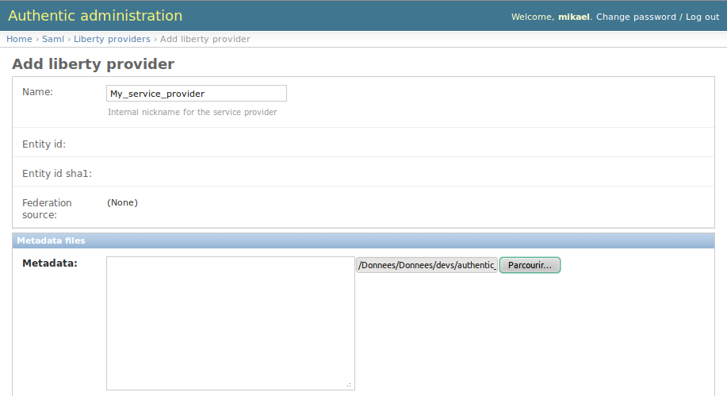
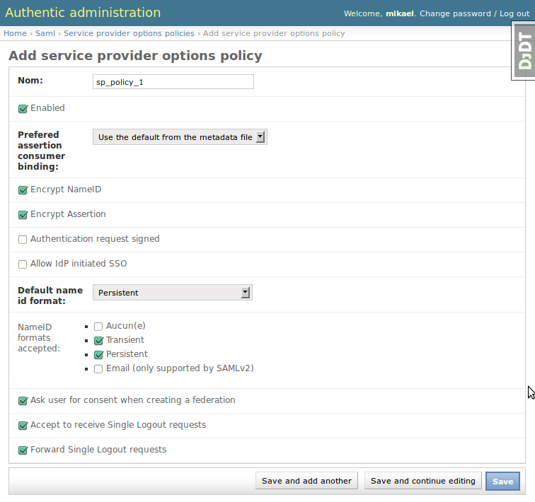
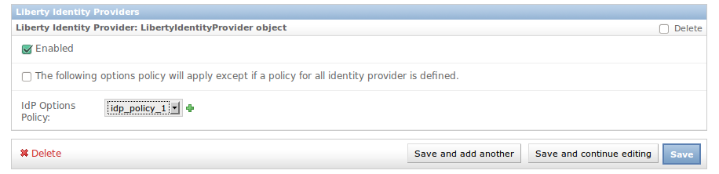
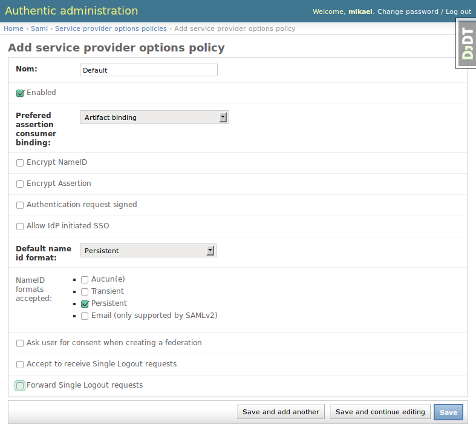
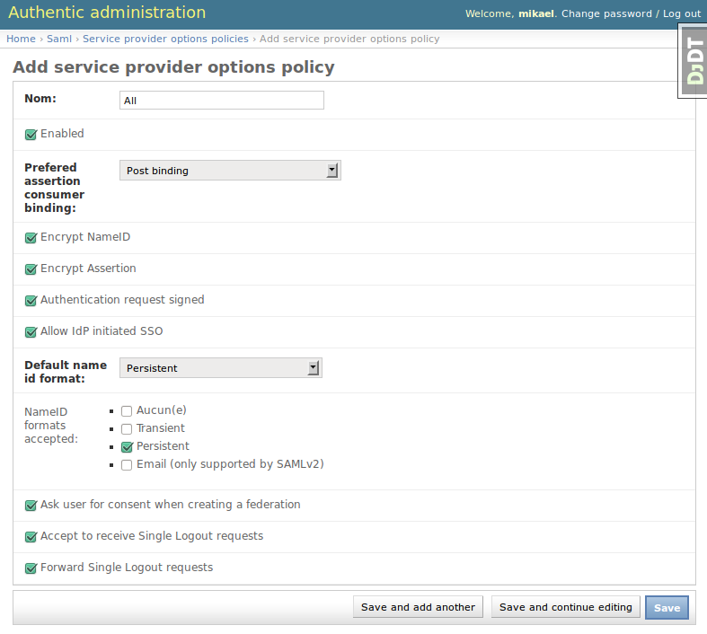

.. _config_saml2_sp:

====================================
Configure SAML 2.0 service providers
====================================

How do I authenticate against Authentic 2 with a SAML2 service provider?
========================================================================

1. Declare Authentic 2 as a SAML2 identity provider on your SAML2 service provider using the SAML2 identity provider metadata of Authentic 2.

Go to http[s]://your.domain.com/idp/saml2/metadata

2. Add and configure a SAML2 service provider in Authentic 2 using the metadata of the service provider.

How do I add and configure a SAML2 service provider in Authentic 2?
===================================================================

You first need to create a new SAML2 service provider entry. This requires the
SAML2 metadata of the service provider.

If your service provider is Authentic 2, the metadata are available at:

    http[s]://your.domain.com/authsaml2/metadata

See :ref:`where_metadata` for more information.

Create a SAML2 service provider entry
-------------------------------------

1. Go to

    http[s]://your.domain.com/admin/saml/libertyprovider/add/

2. Fill the form fields

.. image:: pictures/new_saml2_sp_2.png
   :width: 800 px

**The service provider must be enabled.**

See below about configuring the service provider with policies:

* options of the service provider

* protocol policy

* attribute policy

3. Save

.. image:: pictures/new_saml2_sp_saved.png
   :width: 800 px
   :align: center

Configure the SAML2 service provider options
--------------------------------------------

The SAML2 options of the service provider are configured using sp options
policies.

See the *administration with policy principle* page :ref:`administration_with_policies`.

You may create a regular policy and configure your service provider to use it.

Go to:

    http[s]://your.domain.com/admin/saml/spoptionsidppolicy/add/

Exemple with a policy 'Default':

.. image:: pictures/sp_options_default_saved.png
   :width: 800 px
   :align: center

Exemple with a policy 'All':

If no policy is found for the configuration of the SAML2 options of a service
provider, the following error is displayed when a SSO request is received.

.. image:: pictures/error_no_sp_options.png
   :width: 800 px
   :align: center

Configure the SAML2 service provider protocol options
-----------------------------------------------------

This kind of policy does not use the policy management using global policies.

You should use the default option except if your service provider is a
Shibboleth service provider.

Configure the attribute policy of the service provider
------------------------------------------------------

See the attribute management page :ref:`attribute_management`.

How to refresh metadata of an identity provider hosted at a Well-Known Location?
--------------------------------------------------------------------------------

The Well-Known Location (WKL) means that the entity Id of the provider is a
URL at which the provider metadata are hosted.

To refresh them, select the provider on the list of provider, then select in
the menu 'Update metadata', then click on 'Go'.

.. image:: pictures/update_metadata.png
   :width: 800 px
   :align: center

How to create in bulk service providers with the sync-metadata script?
----------------------------------------------------------------------

See the page explaining the use of the script sync-metadata :ref:`sync-metadata_script`.
