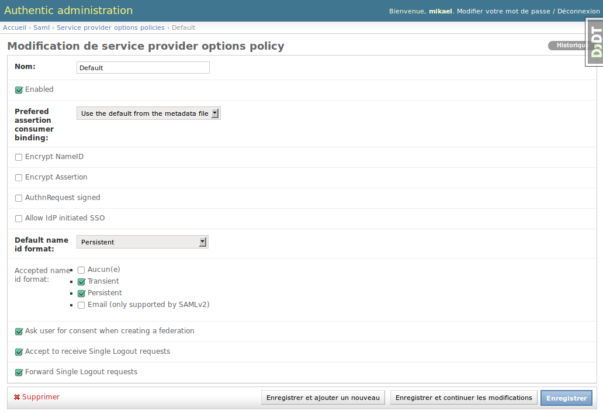
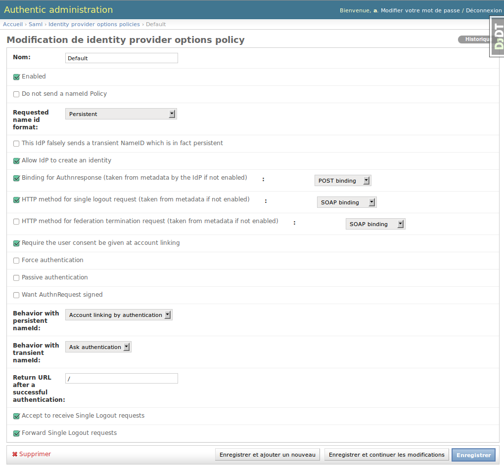
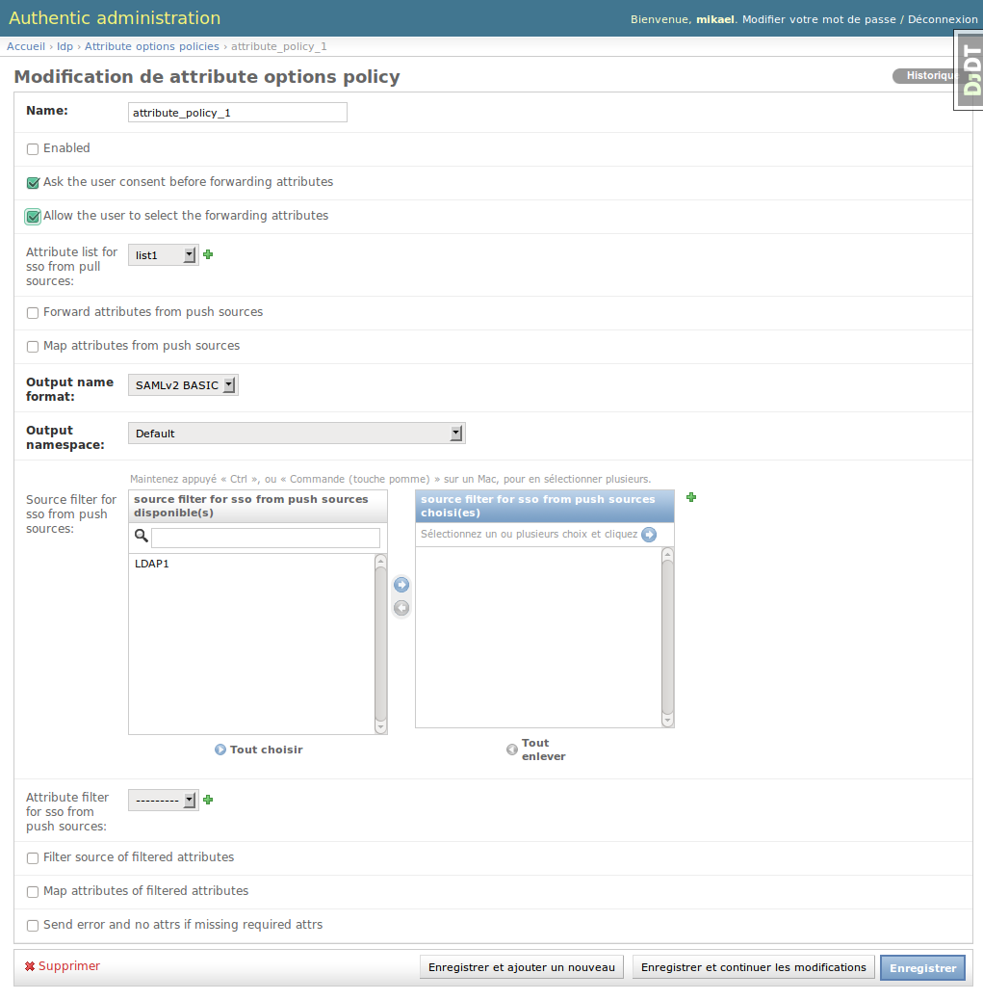

.. _consent_management:

=================================
Consent Management in Authentic 2
=================================

What is the SAML2 federation consent aka account linking consent?
=================================================================

At the first single sign on process on the identity provider side, the user
may be asked if she agrees to federation its local account with the remote
account on the service provider side.

The account linking also called a federation means that the nameID is
persistent and will link the two accounts. This signed identifier allows to
the service provider to login the user without reauthentication during the
following single sign on process.

How the consent is collected is determined by the identity provider. The
service provider receives in the authnRequest the consent attribute
indicating how the user consent was managed.

Account linking consent management on the identity provider side
================================================================

The consent is managed per service provider according to the options policy
that applies to the service provider.

The parameter 'Ask user for consent when creating a federation' determine
if the user consent must be asked to the user.

*Take care that is the identity provider provides the service provider with
a transient nameID, there is no account linking, so there is no need for a
consent.*

*The user consent is only asked once. In other words, if the user already has
a federation, the consent won't be asked anymore.*

If the policy requires the user consent, this can be bypassed using the signal
'avoid_consent'.

Account linking consent management on the service provider side
===============================================================

The service provider may refuse a valid single sign on if the user consent
was not asked.

The parameter 'Require the user consent be given at account linking' of the
identity provider options policy determine the service provider behavior.

How manage attribute forwarding consent?
========================================

*If there is no attribute policy associate with a service provider, no
attribute is forwarded.*

When an attribute policy applies you can configure the consent rules per
service provider.

The choices are:

- Don't ask the user consent
- Ask the consent in all-or-nothing mode
- Allow attribute selection

To ask the user consent, tick the parameter 'Ask the user consent before
forwarding attributes' of the attribute policy that applies to the service
provider.

To allow the attribute selection on the attribute consent page, tick the
parameter 'Allow the user to select the forwarding attributes'.

