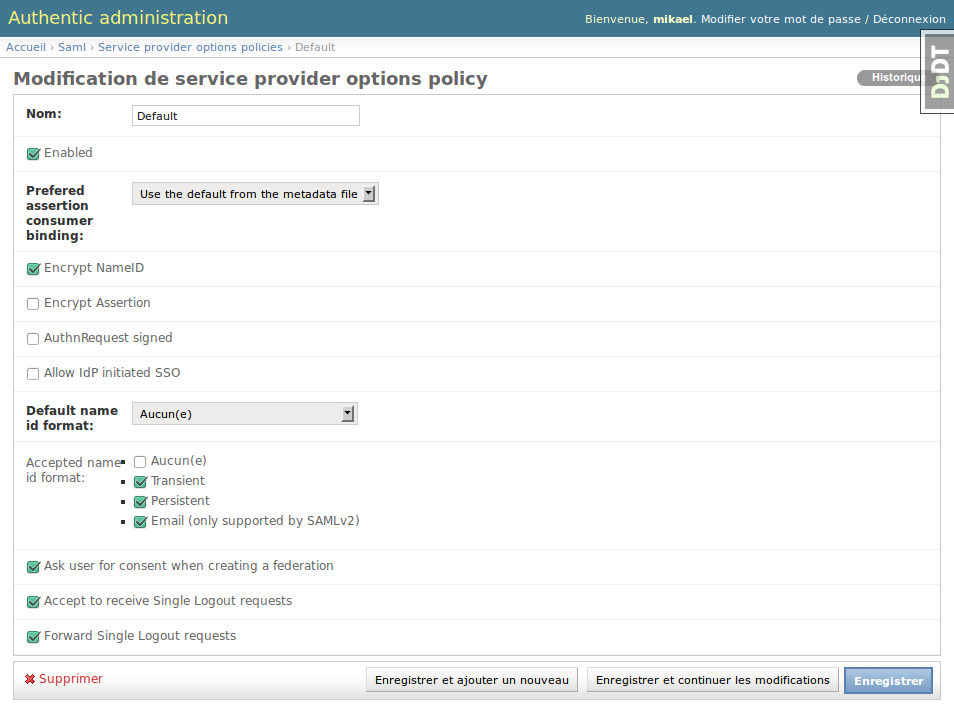
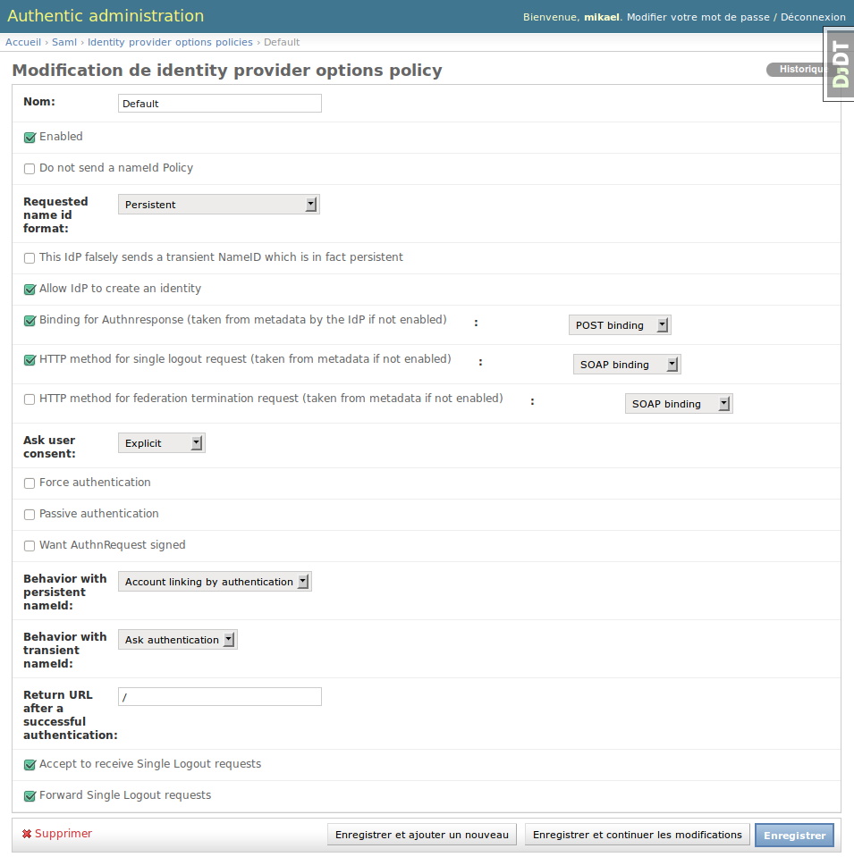
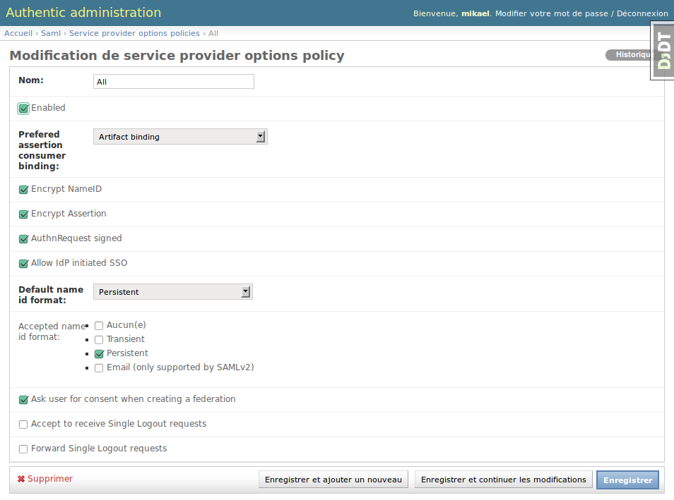
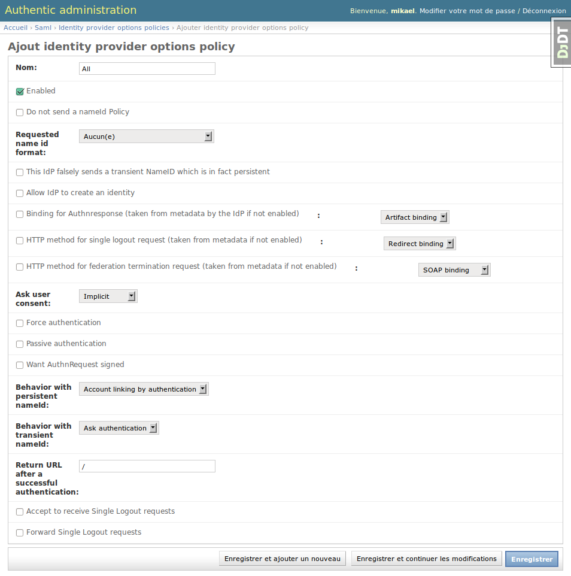

.. _saml2_slo:

======================================
Single Logout Management in Authentic2
======================================

Explanation
===========

Authentic2 implements the single logout profile of SAML2 (SLO). Single Logout is
used to realise to close user session on distributed applications. The Single
Logout is managed by the IdP. However, its exists many profiles all supported
by Authentic2:

- SLO IdP initiated by SOAP
- SLO IdP initiated by Redirect
- SLO SP initiated by SOAP
- SLO SP initiated by Redirect

Then, Authentic2 acting as an IdP but also as a SP (for proxying), a
logout request can be received from:

- the logout button on the user interface;
- a service provider;
- a third identity provider.

The configuration by policy allows to refuse SLO request coming from a SP or
an IdP.

**The the SLO request is accepted or comes from the user interface, at the end
of the process the local session on Authentic2 will always be closed.**

During the process of treatment of the logout request, when the logout request
comes from a SP, if the local session was established through a third SAML2 IdP,
Authentic2 sends it a logout request (SLO proxying). Then, Authentic2
sends logout resuests to all service providers with an active session but the
requesting service provider.

During the process of treatment of the logout request, when the logout request
comes from an IdP, Authentic2 sends logout resuests to all service providers
with an active session.

The configuration by policy allows to select which IdP and SP to logout
forwarding is done.

**Note:** When a logout request comes from an IdP, the logout request is always
forwarded by soap to the service providers.

**Note:** When a logout request comes from an SP:
- if done by SOAP, the logout request is always forwarded by soap to the
identity provider and service providers.
- if done by Redirect, the logout request is forwarded to the
identity provider according to the idp options policy and to the service
providers according to their metadata.

**Note:** When a logout request comes from the user interface, the logout
request is forwarded to the identity provider according to the idp options
policy and to the service providers according to their metadata.

**Note:** To make the SLO works, a policy must be found for the
source or the desitnation of the logout request. By default, when creating a
sp options policy or an IdP options policy the SLO is accepted and forwarded.

See the *administration with policy principle* page :ref:`administration_with_policies`.

How to know if a service provider supports the logout request?
==============================================================

Look for the following elements in the service provider metadata:

- Redirect binding::

  <ns0:SingleLogoutService Binding="urn:oasis:names:tc:SAML:2.0:bindings:HTTP-Redirect" Location="http://sp.mik.lan:8000/authsaml2/singleLogout" ResponseLocation="http://sp.mik.lan:8000/authsaml2/singleLogoutReturn"/>

- SOAP binding::

  <ns0:SingleLogoutService Binding="urn:oasis:names:tc:SAML:2.0:bindings:SOAP" Location="http://sp.mik.lan:8000/authsaml2/singleLogoutSOAP"/>

How to know if an identity provider supports the logout request?
================================================================

Look for the following elements in the identity provider metadata:

- Redirect binding::

  <ns0:SingleLogoutService Binding="urn:oasis:names:tc:SAML:2.0:bindings:HTTP-Redirect" Location="http://idp.mik.lan:8001/idp/saml2/slo" ResponseLocation="http://idp.mik.lan:8001/idp/saml2/slo_return" />

- SOAP binding::

  <ns0:SingleLogoutService Binding="urn:oasis:names:tc:SAML:2.0:bindings:SOAP" Location="http://idp.mik.lan:8001/idp/saml2/slo/soap" />

How activate the SLO?
=====================

No activation is required. However it is required a policy be found for the
source or the desitnation of the logout request.

The sp options policy or idp options policy that applies has parameters to
indicate if the sp or idp which the policy applies is allowed to send and
receive logout requests.

Then, create the 'default' options policy and check the both options
*Accept to receive Single Logout requests* and *Forward Single Logout requests* as follows:

How deactivate the SLO?
=======================

There is no real deactivation process. When it is possible and authorized,
Authentic2 send logout requests when a logout request is received.

If an options policy is not found for the source or the destination of the
logout request, the logout requests are not accepted nor forwarded.

However it is not the right way. The best is to create the 'all' options
policies with the options *Accept to receive Single Logout requests* and *Forward Single Logout requests* unchecked as follows:

Take care that the 'all' policies are authoritative. To desactivate the SLO
but for particular providers, the best is to unchecked these options on the
'default' options policies and apply regular policies to those particular
providers.

How refuse SLO from an identity provider?
=========================================

Uncheck the option *Accept to receive Single Logout requests* of the policy that applies to that identity
provider.

How refuse SLO from a service provider?
=======================================

Uncheck the option *Accept to receive Single Logout requests* of the policy that applies to that service
provider.

How indicate identity providers to not forward logout request?
==============================================================

Uncheck the option *Forward Single Logout requests* of the policies that applies to the identity
providers logout requests must not be forwarded.

How indicate service providers to not forward logout request?
=============================================================

Uncheck the option *Forward Single Logout requests* of the policies that applies to the service
providers logout requests must not be forwarded.

How do manage the SLO without closing the local session?
========================================================

Not implemented.
